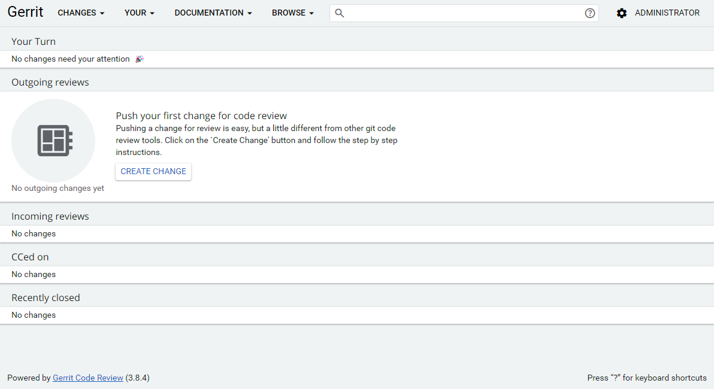
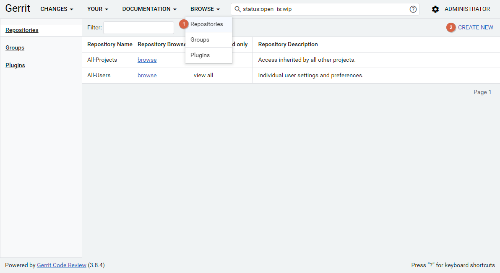
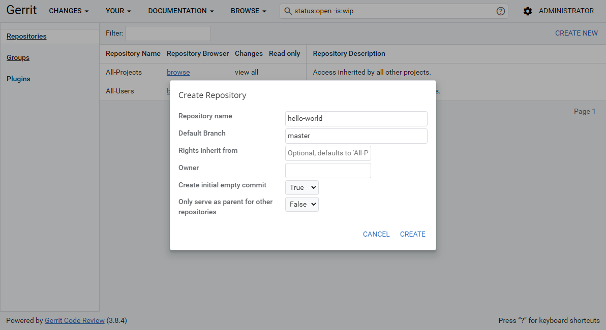
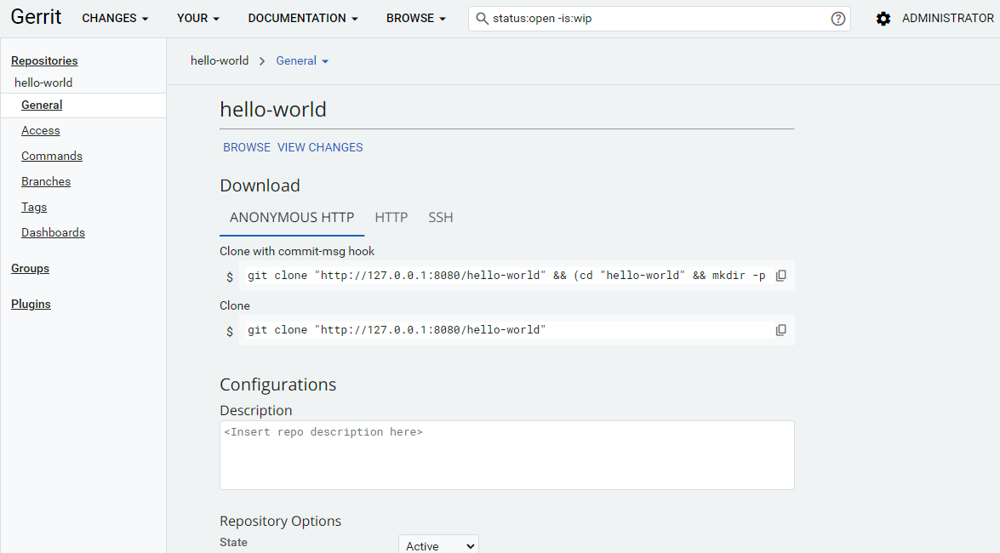

[Gerrit](https://www.gerritcodereview.com/) 是一个基于 Web 的代码审查工具，建立在 Git 版本控制之上。

这里介绍下如何在 Windows 上安装 Gerrit。


<!--truncate-->


## 先决条件

- Java，具体版本参考 [Gerrit 版本发布说明](https://www.gerritcodereview.com/releases-readme.html)。


## 下载 Gerrit

从 [Gerrit 版本发布](https://gerrit-releases.storage.googleapis.com/index.html) 网站下载二进制文件。


## 初始化站点

```shell
java -jar gerrit.war init -d <gerrit_application_directory>
```

> 用户身份验证类型设置为 `DEVELOPMENT_BECOME_ANY_ACCOUNT`，可以使用任何现有用户账户无需任何身份验证。

具体配置参考对应版本的 [Gerrit 文档](https://www.gerritcodereview.com/releases-readme.html)。


## 启动守护进程

```shell
cd <gerrit_application_directory>
java -jar bin\gerrit.war daemon --console-log
```


## 简单使用

打开浏览器访问站点。




创建存储库。








克隆仓库到本地。

```shell
git clone <repository_url>
```


## 参考

- [Gerrit Code Review](https://www.gerritcodereview.com/)
