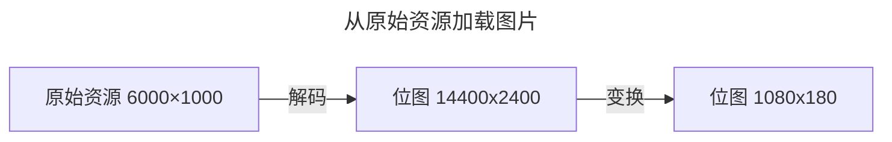
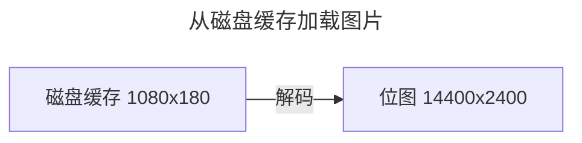

[Glide](https://github.com/bumptech/glide) 是一个快速高效的 Android 图片加载库。最近在使用这个库的时候遇到一个有意思的问题，简单回顾一下。


<!--truncate-->


## 问题背景

我负责开发的一个 Android 应用，有个图片全屏预览的功能，测试同学验证的时候发现有些图片无法加载，问题日志如下：

```java
java.lang.RuntimeException: Canvas: trying to draw too large(138240000bytes) bitmap.
    at android.graphics.RecordingCanvas.throwIfCannotDraw(RecordingCanvas.java:280)
    at android.graphics.BaseRecordingCanvas.drawBitmap(BaseRecordingCanvas.java:88)
    at android.graphics.drawable.BitmapDrawable.draw(BitmapDrawable.java:548)
    at android.widget.ImageView.onDraw(ImageView.java:1436)
    at android.view.View.draw(View.java:22350)
    ...
```

代码大致如下：

```java title="MainActivity.java"
public class MainActivity extends AppCompatActivity {
    @Override
    protected void onCreate(Bundle savedInstanceState) {
        super.onCreate(savedInstanceState);
        EdgeToEdge.enable(this);
        setContentView(R.layout.activity_main);
        final ImageView imageView = findViewById(R.id.image);
        Glide.with(imageView)
            .asBitmap()
            .load(R.drawable.image)
            .transform(new FitCenter())
            .into(imageView);
    }
}
```

```xml title="activity_main.xml"
<androidx.constraintlayout.widget.ConstraintLayout xmlns:android="http://schemas.android.com/apk/res/android"
    xmlns:tools="http://schemas.android.com/tools"
    android:layout_width="match_parent"
    android:layout_height="match_parent"
    tools:context=".MainActivity">

    <ImageView
        android:id="@+id/image"
        android:layout_width="match_parent"
        android:layout_height="match_parent"
        android:scaleType="fitCenter"
        tools:ignore="ContentDescription" />
</androidx.constraintlayout.widget.ConstraintLayout>
```

> - 测试设备：Android 11，1080×2400
> - 测试图片：[6000×1000](assets/test-image.png)

使用测试图片尝试复现问题，却发现图片是可以正常加载的。退出应用终止进程后再次启动应用查看测试图片，神奇的事情发生了——图片加载不出来了，问题日志跟刚开始提到的一模一样。

为什么会这样呢？


## 问题分析

先看下抛出异常的地方：

```java title="android.graphics.RecordingCanvas"
public static final int MAX_BITMAP_SIZE = 100 * 1024 * 1024; // 100 MB

@Override
protected void throwIfCannotDraw(Bitmap bitmap) {
    super.throwIfCannotDraw(bitmap);
    int bitmapSize = bitmap.getByteCount();
    if (bitmapSize > MAX_BITMAP_SIZE) {
        throw new RuntimeException(
                "Canvas: trying to draw too large(" + bitmapSize + "bytes) bitmap.");
    }
}
```

`ImageView` 绘制的位图超过了 100 MB 的大小限制，抛出了运行时异常。测试图片大小是 6000×1000，如果使用 `ARGB_8888` 配置加载，位图大小不到 23 MB（6000×1000×4 字节）。在加载图片的时候还使用了 [`FitCenter`](https://github.com/bumptech/glide/blob/v4.16.0/library/src/main/java/com/bumptech/glide/load/resource/bitmap/FitCenter.java) 变换，最终绘制的位图大小应该是 1080×180，不到 1 MB（1080×180×4 字节）。

使用图片加载请求监听器，加载完成时打印图片信息日志：

```java
Glide.with(imageView)
    .asBitmap()
    .load(R.drawable.image)
    .transform(new FitCenter())
    // highlight-start
    .addListener(new RequestListener<Bitmap>() {
        @Override
        public boolean onLoadFailed(@Nullable GlideException e, @Nullable Object model,
            @NonNull Target<Bitmap> target, boolean isFirstResource) {
            Log.e("GlideExample", "failed to load image", e);
            return false;
        }

        @Override
        public boolean onResourceReady(@NonNull Bitmap resource, @NonNull Object model, Target<Bitmap> target,
            @NonNull DataSource dataSource, boolean isFirstResource) {
            Log.i("GlideExample", "successfully to load image, resource size: "
                + resource.getWidth() + "x" + resource.getHeight()
                + ", data source: "
                + dataSource
                + ", first resource: "
                + isFirstResource);
            return false;
        }
    })
    // highlight-end
    .into(imageView);
```

首次启动应用加载图片日志打印如下：

```log
GlideExample: successfully to load image, resource size: 1080x180, data source: LOCAL, first resource: true
```

终止进程后再次启动应用加载图片日志打印如下：

```log
GlideExample: successfully to load image, resource size: 14400x2400, data source: RESOURCE_DISK_CACHE, first resource: true
```

可以看出，从原始资源加载的位图大小与预期大小一致，而从磁盘缓存加载的位图大小远大于预期大小。

为什么加载出来的位图大小会有差异呢？

[`FitCenter`](https://github.com/bumptech/glide/blob/v4.16.0/library/src/main/java/com/bumptech/glide/load/resource/bitmap/FitCenter.java) 变换调用 [`TransformationUtils#fitCenter`](https://github.com/bumptech/glide/blob/master/library/src/main/java/com/bumptech/glide/load/resource/bitmap/TransformationUtils.java#L154) 处理位图，该方法有日志打印变换前后的位图大小信息：

```java title="com.bumptech.glide.load.resource.bitmap.TransformationUtils"
/**
 * An expensive operation to resize the given Bitmap down so that it fits within the given
 * dimensions maintain the original proportions.
 *
 * @param pool The BitmapPool obtain a bitmap from.
 * @param inBitmap The Bitmap to shrink.
 * @param width The width in pixels the final image will fit within.
 * @param height The height in pixels the final image will fit within.
 * @return A new Bitmap shrunk to fit within the given dimensions, or toFit if toFit's width or
 *     height matches the given dimensions and toFit fits within the given dimensions
 */
public static Bitmap fitCenter(
    @NonNull BitmapPool pool, @NonNull Bitmap inBitmap, int width, int height) {
    if (inBitmap.getWidth() == width && inBitmap.getHeight() == height) {
        if (Log.isLoggable(TAG, Log.VERBOSE)) {
            Log.v(TAG, "requested target size matches input, returning input");
        }
        return inBitmap;
    }
    final float widthPercentage = width / (float) inBitmap.getWidth();
    final float heightPercentage = height / (float) inBitmap.getHeight();
    final float minPercentage = Math.min(widthPercentage, heightPercentage);

    // Round here in case we've decoded exactly the image we want, but take the floor below to
    // avoid a line of garbage or blank pixels in images.
    int targetWidth = Math.round(minPercentage * inBitmap.getWidth());
    int targetHeight = Math.round(minPercentage * inBitmap.getHeight());

    if (inBitmap.getWidth() == targetWidth && inBitmap.getHeight() == targetHeight) {
        if (Log.isLoggable(TAG, Log.VERBOSE)) {
            Log.v(TAG, "adjusted target size matches input, returning input");
        }
        return inBitmap;
    }

    // Take the floor of the target width/height, not round. If the matrix
    // passed into drawBitmap rounds differently, we want to slightly
    // overdraw, not underdraw, to avoid artifacts from bitmap reuse.
    targetWidth = (int) (minPercentage * inBitmap.getWidth());
    targetHeight = (int) (minPercentage * inBitmap.getHeight());

    Bitmap.Config config = getNonNullConfig(inBitmap);
    Bitmap toReuse = pool.get(targetWidth, targetHeight, config);

    // We don't add or remove alpha, so keep the alpha setting of the Bitmap we were given.
    TransformationUtils.setAlpha(inBitmap, toReuse);

    // highlight-start
    if (Log.isLoggable(TAG, Log.VERBOSE)) {
        Log.v(TAG, "request: " + width + "x" + height);
        Log.v(TAG, "toFit:   " + inBitmap.getWidth() + "x" + inBitmap.getHeight());
        Log.v(TAG, "toReuse: " + toReuse.getWidth() + "x" + toReuse.getHeight());
        Log.v(TAG, "minPct:   " + minPercentage);
    }
    // highlight-end

    Matrix matrix = new Matrix();
    matrix.setScale(minPercentage, minPercentage);
    applyMatrix(inBitmap, toReuse, matrix);

    return toReuse;
}
```

调整 `TransformationUtils` 日志级别：

```shell
adb shell setprop log.tag.TransformationUtils VERBOSE
```

从原始资源加载图片日志打印如下：

```log
TransformationUtils: request: 1080x2400
TransformationUtils: toFit:   14400x2400
TransformationUtils: toReuse: 1080x180
TransformationUtils: minPct:   0.075
```

[`FitCenter`](https://github.com/bumptech/glide/blob/v4.16.0/library/src/main/java/com/bumptech/glide/load/resource/bitmap/FitCenter.java) 变换前位图大小是 14400x2400，变换后位图大小是 1080x180，也就是变换前位图大小是异常的，变换后调整正常了。



从磁盘缓存加载图片无相关日志打印，此时加载的是前面缓存的变换后的图片。查找 [`Transformation#transform`](https://github.com/bumptech/glide/blob/v4.16.0/library/src/main/java/com/bumptech/glide/load/Transformation.java#L65) 的调用，可以在 [`DecodeJob#onResourceDecoded`](https://github.com/bumptech/glide/blob/v4.16.0/library/src/main/java/com/bumptech/glide/load/engine/DecodeJob.java#L571) 找到答案：

```java title="com.bumptech.glide.load.engine.DecodeJob"
@Synthetic
@NonNull
<Z> Resource<Z> onResourceDecoded(DataSource dataSource, @NonNull Resource<Z> decoded) {
    @SuppressWarnings("unchecked")
    Class<Z> resourceSubClass = (Class<Z>) decoded.get().getClass();
    Transformation<Z> appliedTransformation = null;
    Resource<Z> transformed = decoded;
    // highlight-start
    if (dataSource != DataSource.RESOURCE_DISK_CACHE) {
        appliedTransformation = decodeHelper.getTransformation(resourceSubClass);
        transformed = appliedTransformation.transform(glideContext, decoded, width, height);
    }
    // highlight-end
    // TODO: Make this the responsibility of the Transformation.
    if (!decoded.equals(transformed)) {
        decoded.recycle();
    }

    final EncodeStrategy encodeStrategy;
    final ResourceEncoder<Z> encoder;
    if (decodeHelper.isResourceEncoderAvailable(transformed)) {
        encoder = decodeHelper.getResultEncoder(transformed);
        encodeStrategy = encoder.getEncodeStrategy(options);
    } else {
        encoder = null;
        encodeStrategy = EncodeStrategy.NONE;
    }

    Resource<Z> result = transformed;
    boolean isFromAlternateCacheKey = !decodeHelper.isSourceKey(currentSourceKey);
    if (diskCacheStrategy.isResourceCacheable(
        isFromAlternateCacheKey, dataSource, encodeStrategy)) {
        if (encoder == null) {
            throw new Registry.NoResultEncoderAvailableException(transformed.get().getClass());
        }
        final Key key;
        switch (encodeStrategy) {
            case SOURCE:
                key = new DataCacheKey(currentSourceKey, signature);
                break;
            // highlight-start
            case TRANSFORMED:
                key =
                    new ResourceCacheKey(
                        decodeHelper.getArrayPool(),
                        currentSourceKey,
                        signature,
                        width,
                        height,
                        appliedTransformation,
                        resourceSubClass,
                        options);
                break;
            // highlight-end
            default:
                throw new IllegalArgumentException("Unknown strategy: " + encodeStrategy);
        }

        LockedResource<Z> lockedResult = LockedResource.obtain(transformed);
        deferredEncodeManager.init(key, encoder, lockedResult);
        result = lockedResult;
    }
    return result;
}
```



解码过程发生了什么？

查找 [`DecodeJob#onResourceDecoded`](https://github.com/bumptech/glide/blob/v4.16.0/library/src/main/java/com/bumptech/glide/load/engine/DecodeJob.java#L571) 的调用，不难找到解码的代码 [`ResourceDecoder#decode`](https://github.com/bumptech/glide/blob/v4.16.0/library/src/main/java/com/bumptech/glide/load/ResourceDecoder.java#L62)：

```java title="com.bumptech.glide.load.engine.DecodePath"
public Resource<Transcode> decode(
    DataRewinder<DataType> rewinder,
    int width,
    int height,
    @NonNull Options options,
    DecodePath.DecodeCallback<ResourceType> callback)
    throws GlideException {
    // highlight-next-line
    Resource<ResourceType> decoded = decodeResource(rewinder, width, height, options);
    Resource<ResourceType> transformed = callback.onResourceDecoded(decoded);
    return transcoder.transcode(transformed, options);
}

@NonNull
private Resource<ResourceType> decodeResource(
    DataRewinder<DataType> rewinder, int width, int height, @NonNull Options options)
    throws GlideException {
    List<Throwable> exceptions = Preconditions.checkNotNull(listPool.acquire());
    try {
        // highlight-next-line
        return decodeResourceWithList(rewinder, width, height, options, exceptions);
    } finally {
        listPool.release(exceptions);
    }
}

@NonNull
private Resource<ResourceType> decodeResourceWithList(
    DataRewinder<DataType> rewinder,
    int width,
    int height,
    @NonNull Options options,
    List<Throwable> exceptions)
    throws GlideException {
    Resource<ResourceType> result = null;
    //noinspection ForLoopReplaceableByForEach to improve perf
    for (int i = 0, size = decoders.size(); i < size; i++) {
        ResourceDecoder<DataType, ResourceType> decoder = decoders.get(i);
        try {
            DataType data = rewinder.rewindAndGet();
            if (decoder.handles(data, options)) {
                data = rewinder.rewindAndGet();
                // highlight-next-line
                result = decoder.decode(data, width, height, options);
            }
            // Some decoders throw unexpectedly. If they do, we shouldn't fail the entire load path, but
            // instead log and continue. See #2406 for an example.
        } catch (IOException | RuntimeException | OutOfMemoryError e) {
            if (Log.isLoggable(TAG, Log.VERBOSE)) {
                Log.v(TAG, "Failed to decode data for " + decoder, e);
            }
            exceptions.add(e);
        }

        if (result != null) {
            break;
        }
    }

    if (result == null) {
        throw new GlideException(failureMessage, new ArrayList<>(exceptions));
    }
    return result;
}
```

通过断点调试，可以知道从原始资源加载图片调用 [`StreamBitmapDecoder#decode`](https://github.com/bumptech/glide/blob/v4.16.0/library/src/main/java/com/bumptech/glide/load/resource/bitmap/StreamBitmapDecoder.java#L34) 解码，从磁盘缓存加载图片调用 [`ByteBufferBitmapDecoder#decode`](https://github.com/bumptech/glide/blob/v4.16.0/library/src/main/java/com/bumptech/glide/load/resource/bitmap/ByteBufferBitmapDecoder.java#L25) 解码。

```java title="com.bumptech.glide.load.resource.bitmap.StreamBitmapDecoder"
@Override
public Resource<Bitmap> decode(
    @NonNull InputStream source, int width, int height, @NonNull Options options)
    throws IOException {

    // Use to fix the mark limit to avoid allocating buffers that fit entire images.
    final RecyclableBufferedInputStream bufferedStream;
    final boolean ownsBufferedStream;
    if (source instanceof RecyclableBufferedInputStream) {
        bufferedStream = (RecyclableBufferedInputStream) source;
        ownsBufferedStream = false;
    } else {
        bufferedStream = new RecyclableBufferedInputStream(source, byteArrayPool);
        ownsBufferedStream = true;
    }

    // Use to retrieve exceptions thrown while reading.
    // TODO(#126): when the framework no longer returns partially decoded Bitmaps or provides a
    // way to determine if a Bitmap is partially decoded, consider removing.
    ExceptionPassthroughInputStream exceptionStream =
        ExceptionPassthroughInputStream.obtain(bufferedStream);

    // Use to read data.
    // Ensures that we can always reset after reading an image header so that we can still
    // attempt to decode the full image even when the header decode fails and/or overflows our read
    // buffer. See #283.
    MarkEnforcingInputStream invalidatingStream = new MarkEnforcingInputStream(exceptionStream);
    StreamBitmapDecoder.UntrustedCallbacks callbacks = new StreamBitmapDecoder.UntrustedCallbacks(bufferedStream, exceptionStream);
    try {
        // highlight-next-line
        return downsampler.decode(invalidatingStream, width, height, options, callbacks);
    } finally {
        exceptionStream.release();
        if (ownsBufferedStream) {
            bufferedStream.release();
        }
    }
}
```

```java title="com.bumptech.glide.load.resource.bitmap.ByteBufferBitmapDecoder"
@Override
public Resource<Bitmap> decode(
    @NonNull ByteBuffer source, int width, int height, @NonNull Options options)
    throws IOException {
    // highlight-next-line
    return downsampler.decode(source, width, height, options);
}
```

不论哪个解码方法，最终都调用了 [`Downsampler#decodeFromWrappedStreams`](https://github.com/bumptech/glide/blob/v4.16.0/library/src/main/java/com/bumptech/glide/load/resource/bitmap/Downsampler.java#L303)，与尺寸相关的计算通过 [`Downsampler#calculateScaling`](https://github.com/bumptech/glide/blob/v4.16.0/library/src/main/java/com/bumptech/glide/load/resource/bitmap/Downsampler.java#L459) 完成：

```java title="com.bumptech.glide.load.resource.bitmap.Downsampler"
private static void calculateScaling(
    ImageHeaderParser.ImageType imageType,
    ImageReader imageReader,
    Downsampler.DecodeCallbacks decodeCallbacks,
    BitmapPool bitmapPool,
    DownsampleStrategy downsampleStrategy,
    int degreesToRotate,
    int sourceWidth,
    int sourceHeight,
    int targetWidth,
    int targetHeight,
    BitmapFactory.Options options)
    throws IOException {
    // We can't downsample source content if we can't determine its dimensions.
    if (sourceWidth <= 0 || sourceHeight <= 0) {
        if (Log.isLoggable(TAG, Log.DEBUG)) {
            Log.d(
                TAG,
                "Unable to determine dimensions for: "
                    + imageType
                    + " with target ["
                    + targetWidth
                    + "x"
                    + targetHeight
                    + "]");
        }
        return;
    }

    int orientedSourceWidth = sourceWidth;
    int orientedSourceHeight = sourceHeight;
    // If we're rotating the image +-90 degrees, we need to downsample accordingly so the image
    // width is decreased to near our target's height and the image height is decreased to near
    // our target width.
    //noinspection SuspiciousNameCombination
    if (isRotationRequired(degreesToRotate)) {
        orientedSourceWidth = sourceHeight;
        orientedSourceHeight = sourceWidth;
    }

    final float exactScaleFactor =
        downsampleStrategy.getScaleFactor(
            orientedSourceWidth, orientedSourceHeight, targetWidth, targetHeight);

    if (exactScaleFactor <= 0f) {
        throw new IllegalArgumentException(
            "Cannot scale with factor: "
                + exactScaleFactor
                + " from: "
                + downsampleStrategy
                + ", source: ["
                + sourceWidth
                + "x"
                + sourceHeight
                + "]"
                + ", target: ["
                + targetWidth
                + "x"
                + targetHeight
                + "]");
    }

    DownsampleStrategy.SampleSizeRounding rounding =
        downsampleStrategy.getSampleSizeRounding(
            orientedSourceWidth, orientedSourceHeight, targetWidth, targetHeight);
    if (rounding == null) {
        throw new IllegalArgumentException("Cannot round with null rounding");
    }

    int outWidth = round(exactScaleFactor * orientedSourceWidth);
    int outHeight = round(exactScaleFactor * orientedSourceHeight);

    int widthScaleFactor = orientedSourceWidth / outWidth;
    int heightScaleFactor = orientedSourceHeight / outHeight;

    // TODO: This isn't really right for both CenterOutside and CenterInside. Consider allowing
    // DownsampleStrategy to pick, or trying to do something more sophisticated like picking the
    // scale factor that leads to an exact match.
    int scaleFactor =
        rounding == DownsampleStrategy.SampleSizeRounding.MEMORY
            ? Math.max(widthScaleFactor, heightScaleFactor)
            : Math.min(widthScaleFactor, heightScaleFactor);

    int powerOfTwoSampleSize;
    // BitmapFactory does not support downsampling wbmp files on platforms <= M. See b/27305903.
    if (Build.VERSION.SDK_INT <= 23
        && NO_DOWNSAMPLE_PRE_N_MIME_TYPES.contains(options.outMimeType)) {
        powerOfTwoSampleSize = 1;
    } else {
        powerOfTwoSampleSize = Math.max(1, Integer.highestOneBit(scaleFactor));
        if (rounding == DownsampleStrategy.SampleSizeRounding.MEMORY
            && powerOfTwoSampleSize < (1.f / exactScaleFactor)) {
            powerOfTwoSampleSize = powerOfTwoSampleSize << 1;
        }
    }

    // Here we mimic framework logic for determining how inSampleSize division is rounded on various
    // versions of Android. The logic here has been tested on emulators for Android versions 15-26.
    // PNG - Always uses floor
    // JPEG - Always uses ceiling
    // Webp - Prior to N, always uses floor. At and after N, always uses round.
    options.inSampleSize = powerOfTwoSampleSize;
    int powerOfTwoWidth;
    int powerOfTwoHeight;
    if (imageType == ImageHeaderParser.ImageType.JPEG) {
        // libjpegturbo can downsample up to a sample size of 8. libjpegturbo uses ceiling to round.
        // After libjpegturbo's native rounding, skia does a secondary scale using floor
        // (integer division). Here we replicate that logic.
        int nativeScaling = Math.min(powerOfTwoSampleSize, 8);
        powerOfTwoWidth = (int) Math.ceil(orientedSourceWidth / (float) nativeScaling);
        powerOfTwoHeight = (int) Math.ceil(orientedSourceHeight / (float) nativeScaling);
        int secondaryScaling = powerOfTwoSampleSize / 8;
        if (secondaryScaling > 0) {
            powerOfTwoWidth = powerOfTwoWidth / secondaryScaling;
            powerOfTwoHeight = powerOfTwoHeight / secondaryScaling;
        }
    } else if (imageType == ImageHeaderParser.ImageType.PNG || imageType == ImageHeaderParser.ImageType.PNG_A) {
        powerOfTwoWidth = (int) Math.floor(orientedSourceWidth / (float) powerOfTwoSampleSize);
        powerOfTwoHeight = (int) Math.floor(orientedSourceHeight / (float) powerOfTwoSampleSize);
    } else if (imageType.isWebp()) {
        if (Build.VERSION.SDK_INT >= Build.VERSION_CODES.N) {
            powerOfTwoWidth = Math.round(orientedSourceWidth / (float) powerOfTwoSampleSize);
            powerOfTwoHeight = Math.round(orientedSourceHeight / (float) powerOfTwoSampleSize);
        } else {
            powerOfTwoWidth = (int) Math.floor(orientedSourceWidth / (float) powerOfTwoSampleSize);
            powerOfTwoHeight = (int) Math.floor(orientedSourceHeight / (float) powerOfTwoSampleSize);
        }
    } else if (orientedSourceWidth % powerOfTwoSampleSize != 0
        || orientedSourceHeight % powerOfTwoSampleSize != 0) {
        // If we're not confident the image is in one of our types, fall back to checking the
        // dimensions again. inJustDecodeBounds decodes do obey inSampleSize.
        int[] dimensions = getDimensions(imageReader, options, decodeCallbacks, bitmapPool);
        // Power of two downsampling in BitmapFactory uses a variety of random factors to determine
        // rounding that we can't reliably replicate for all image formats. Use ceiling here to make
        // sure that we at least provide a Bitmap that's large enough to fit the content we're going
        // to load.
        powerOfTwoWidth = dimensions[0];
        powerOfTwoHeight = dimensions[1];
    } else {
        powerOfTwoWidth = orientedSourceWidth / powerOfTwoSampleSize;
        powerOfTwoHeight = orientedSourceHeight / powerOfTwoSampleSize;
    }

    // highlight-start
    double adjustedScaleFactor =
        downsampleStrategy.getScaleFactor(
            powerOfTwoWidth, powerOfTwoHeight, targetWidth, targetHeight);

    // Density scaling is only supported if inBitmap is null prior to KitKat. Avoid setting
    // densities here so we calculate the final Bitmap size correctly.
    if (Build.VERSION.SDK_INT >= Build.VERSION_CODES.KITKAT) {
        options.inTargetDensity = adjustTargetDensityForError(adjustedScaleFactor);
        options.inDensity = getDensityMultiplier(adjustedScaleFactor);
    }
    if (isScaling(options)) {
        options.inScaled = true;
    } else {
        options.inDensity = options.inTargetDensity = 0;
    }
    // highlight-end

    if (Log.isLoggable(TAG, Log.VERBOSE)) {
        Log.v(
            TAG,
            "Calculate scaling"
                + ", source: ["
                + sourceWidth
                + "x"
                + sourceHeight
                + "]"
                + ", degreesToRotate: "
                + degreesToRotate
                + ", target: ["
                + targetWidth
                + "x"
                + targetHeight
                + "]"
                + ", power of two scaled: ["
                + powerOfTwoWidth
                + "x"
                + powerOfTwoHeight
                + "]"
                + ", exact scale factor: "
                + exactScaleFactor
                + ", power of 2 sample size: "
                + powerOfTwoSampleSize
                + ", adjusted scale factor: "
                + adjustedScaleFactor
                + ", target density: "
                + options.inTargetDensity
                + ", density: "
                + options.inDensity);
    }
}
```

调整 `Downsampler` 日志级别：

```shell
adb shell setprop log.tag.Downsampler VERBOSE
```

从原始资源加载图片日志打印如下：

```log
Downsampler: Calculate scaling, source: [6000x1000], degreesToRotate: 0, target: [1080x2400], power of two scaled: [6000x1000], exact scale factor: 2.4, power of 2 sample size: 1, adjusted scale factor: 2.4000000953674316, target density: 2147483646, density: 894784817
Downsampler: Calculated target [14400x2400] for source [6000x1000], sampleSize: 1, targetDensity: 2147483646, density: 894784817, density multiplier: 2.4
```

从磁盘缓存加载图片日志打印如下：

```log
Downsampler: Calculate scaling, source: [1080x180], degreesToRotate: 0, target: [1080x2400], power of two scaled: [1080x180], exact scale factor: 13.333333, power of 2 sample size: 1, adjusted scale factor: 13.333333015441895, target density: 2147483642, density: 161061277
Downsampler: Calculated target [14400x2400] for source [1080x180], sampleSize: 1, targetDensity: 2147483642, density: 161061277, density multiplier: 13.333333
```

问题关键点找到了，[`DownsampleStrategy#getScaleFactor`](https://github.com/bumptech/glide/blob/v4.16.0/library/src/main/java/com/bumptech/glide/load/resource/bitmap/DownsampleStrategy.java#L122) 根据源大小和目标大小计算出缩放比例，不同的下采样策略有不同的计算规则，计算出的缩放比例决定了最终目标大小。通过断点调试，可以看到使用的下采样策略都是 [`DownsampleStrategy#CENTER_OUTSIDE`](https://github.com/bumptech/glide/blob/v4.16.0/library/src/main/java/com/bumptech/glide/load/resource/bitmap/DownsampleStrategy.java#L81)，默认下采样策略 [`DownsampleStrategy#DEFAULT`](https://github.com/bumptech/glide/blob/v4.16.0/library/src/main/java/com/bumptech/glide/load/resource/bitmap/DownsampleStrategy.java#L87) 也是该策略。

```java title="com.bumptech.glide.load.resource.bitmap.DownsampleStrategy"
/**
 * Scales, maintaining the original aspect ratio, so that one of the image's dimensions is exactly
 * equal to the requested size and the other dimension is greater than or equal to the requested
 * size.
 *
 * <p>This method will upscale if the requested width and height are greater than the source width
 * and height. To avoid upscaling, use {@link #AT_LEAST}, {@link #AT_MOST}, or {@link
 * #CENTER_INSIDE}.
 *
 * <p>On pre-KitKat devices, {@link Downsampler} treats this as equivalent to {@link #AT_LEAST}
 * because only power of two downsampling can be used.
 */
public static final DownsampleStrategy CENTER_OUTSIDE = new DownsampleStrategy.CenterOutside();

/** Default strategy, currently {@link #CENTER_OUTSIDE}. */
public static final DownsampleStrategy DEFAULT = CENTER_OUTSIDE;

private static class CenterOutside extends DownsampleStrategy {

    @Synthetic
    CenterOutside() {}

    @Override
    public float getScaleFactor(
        int sourceWidth, int sourceHeight, int requestedWidth, int requestedHeight) {
        // highlight-start
        float widthPercentage = requestedWidth / (float) sourceWidth;
        float heightPercentage = requestedHeight / (float) sourceHeight;
        return Math.max(widthPercentage, heightPercentage);
        // highlight-end
    }

    @Override
    public SampleSizeRounding getSampleSizeRounding(
        int sourceWidth, int sourceHeight, int requestedWidth, int requestedHeight) {
        return SampleSizeRounding.QUALITY;
    }
}
```

[`DownsampleStrategy#CENTER_OUTSIDE`](https://github.com/bumptech/glide/blob/v4.16.0/library/src/main/java/com/bumptech/glide/load/resource/bitmap/DownsampleStrategy.java#L81) 下采样策略定义为保持原始纵横比缩放，使得图像的一个尺寸（宽度或高度）等于请求的相应尺寸，另一个尺寸大于或等于请求的相应尺寸。根据定义，缩放比例计算规则为 `max(requestedWidth/sourceWidth, requestedHeight/sourceHeight)`。

到这里，问题已经分析清楚了。


## 问题解决

使用合适的下采样策略 [`DownsampleStrategy#FIT_CENTER`](https://github.com/bumptech/glide/blob/v4.16.0/library/src/main/java/com/bumptech/glide/load/resource/bitmap/DownsampleStrategy.java#L64)：

```java title="com.bumptech.glide.load.resource.bitmap.DownsampleStrategy"
/**
 * Scales, maintaining the original aspect ratio, so that one of the image's dimensions is exactly
 * equal to the requested size and the other dimension is less than or equal to the requested
 * size.
 *
 * <p>This method will upscale if the requested width and height are greater than the source width
 * and height. To avoid upscaling, use {@link #AT_LEAST}, {@link #AT_MOST} or {@link
 * #CENTER_INSIDE}.
 *
 * <p>On pre-KitKat devices, {@code FIT_CENTER} will downsample by a power of two only so that one
 * of the image's dimensions is greater than or equal to the requested size. No guarantees are
 * made about the second dimensions. This is <em>NOT</em> the same as {@link #AT_LEAST} because
 * only one dimension, not both, are greater than or equal to the requested dimensions, the other
 * may be smaller.
 */
public static final DownsampleStrategy FIT_CENTER = new DownsampleStrategy.FitCenter();

@Synthetic
static final boolean IS_BITMAP_FACTORY_SCALING_SUPPORTED =
    Build.VERSION.SDK_INT >= Build.VERSION_CODES.KITKAT;

private static class FitCenter extends DownsampleStrategy {

    @Synthetic
    FitCenter() {}

    @Override
    public float getScaleFactor(
        int sourceWidth, int sourceHeight, int requestedWidth, int requestedHeight) {
        if (IS_BITMAP_FACTORY_SCALING_SUPPORTED) {
            // highlight-start
            float widthPercentage = requestedWidth / (float) sourceWidth;
            float heightPercentage = requestedHeight / (float) sourceHeight;

            return Math.min(widthPercentage, heightPercentage);
            // highlight-end
        } else {
            // Similar to AT_LEAST, but only require one dimension or the other to be >= requested
            // rather than both.
            int maxIntegerFactor =
                Math.max(sourceHeight / requestedHeight, sourceWidth / requestedWidth);
            return maxIntegerFactor == 0 ? 1f : 1f / Integer.highestOneBit(maxIntegerFactor);
        }
    }

    @Override
    public SampleSizeRounding getSampleSizeRounding(
        int sourceWidth, int sourceHeight, int requestedWidth, int requestedHeight) {
        if (IS_BITMAP_FACTORY_SCALING_SUPPORTED) {
            return SampleSizeRounding.QUALITY;
        } else {
            // TODO: This doesn't seem right, but otherwise we can skip a sample size because QUALITY
            // prefers the smaller of the width and height scale factor. MEMORY is a hack that
            // lets us prefer the larger of the two.
            return SampleSizeRounding.MEMORY;
        }
    }
}
```

```java
Glide.with(imageView)
    .asBitmap()
    .load(R.drawable.image)
    // highlight-next-line
    .downsample(DownsampleStrategy.FIT_CENTER)
    .transform(new FitCenter())
    .into(imageView);
```

图片正常加载，加载的位图大小也与预期大小一致。

> 从原始资源加载图片日志打印如下：
>
> ```log
> Downsampler: Calculate scaling, source: [6000x1000], degreesToRotate: 0, target: [1080x2400], power of two scaled: [1500x250], exact scale factor: 0.18, power of 2 sample size: 4, adjusted scale factor: 0.7200000286102295, target density: 1113255703, density: 1546188287
> Downsampler: Calculated target [1080x180] for source [6000x1000], sampleSize: 4, targetDensity: 1113255703, density: 1546188287, density multiplier: 0.7200001
> ```
>
> 从磁盘缓存加载图片日志打印如下：
>
> ```log
> Downsampler: Calculate scaling, source: [1080x180], degreesToRotate: 0, target: [1080x2400], power of two scaled: [1080x180], exact scale factor: 1.0, power of 2 sample size: 1, adjusted scale factor: 1.0, target density: 0, density: 0
> Downsampler: Calculated target [1080x180] for source [1080x180], sampleSize: 1, targetDensity: 0, density: 0, density multiplier: 1.0
> ```

调用 [`BaseRequestOptions#fitCenter`](https://github.com/bumptech/glide/blob/v4.16.0/library/src/main/java/com/bumptech/glide/request/BaseRequestOptions.java#L767) 可以同时设置下采样策略 [`DownsampleStrategy#FIT_CENTER`](https://github.com/bumptech/glide/blob/v4.16.0/library/src/main/java/com/bumptech/glide/load/resource/bitmap/DownsampleStrategy.java#L64) 和变换 [`FitCenter`](https://github.com/bumptech/glide/blob/v4.16.0/library/src/main/java/com/bumptech/glide/load/resource/bitmap/FitCenter.java)：

```java title="com.bumptech.glide.request.BaseRequestOptions"
/**
 * Applies {@link FitCenter} and to all default types, {@link DownsampleStrategy#FIT_CENTER} to
 * image types, and throws an exception if asked to transform an unknown type.
 *
 * <p>This will override previous calls to {@link #dontTransform()} and previous calls to {@link
 * #downsample(DownsampleStrategy)}.
 *
 * @see #transform(Class, Transformation)
 * @see #optionalFitCenter()
 */
@NonNull
@CheckResult
public T fitCenter() {
    // highlight-next-line
    return scaleOnlyTransform(DownsampleStrategy.FIT_CENTER, new FitCenter());
}
```

```java
Glide.with(imageView)
    .asBitmap()
    .load(R.drawable.image)
    // highlight-next-line
    .fitCenter()
    .into(imageView);
```

`ImageView` 设置了 `ScaleType` 的情况下，不设置下采样策略和变换也是可以的。

```java title="com.bumptech.glide.RequestBuilder"
/**
 * Sets the {@link ImageView} the resource will be loaded into, cancels any existing loads into
 * the view, and frees any resources Glide may have previously loaded into the view so they may be
 * reused.
 *
 * @see RequestManager#clear(Target)
 * @param view The view to cancel previous loads for and load the new resource into.
 * @return The {@link com.bumptech.glide.request.target.Target} used to wrap the given {@link
 *     ImageView}.
 */
@NonNull
public ViewTarget<ImageView, TranscodeType> into(@NonNull ImageView view) {
    Util.assertMainThread();
    Preconditions.checkNotNull(view);

    // highlight-start
    BaseRequestOptions<?> requestOptions = this;
    if (!requestOptions.isTransformationSet()
        && requestOptions.isTransformationAllowed()
        && view.getScaleType() != null) {
        // Clone in this method so that if we use this RequestBuilder to load into a View and then
        // into a different target, we don't retain the transformation applied based on the previous
        // View's scale type.
        switch (view.getScaleType()) {
            case CENTER_CROP:
                requestOptions = requestOptions.clone().optionalCenterCrop();
                break;
            case CENTER_INSIDE:
                requestOptions = requestOptions.clone().optionalCenterInside();
                break;
            case FIT_CENTER:
            case FIT_START:
            case FIT_END:
                requestOptions = requestOptions.clone().optionalFitCenter();
                break;
            case FIT_XY:
                requestOptions = requestOptions.clone().optionalCenterInside();
                break;
            case CENTER:
            case MATRIX:
            default:
                // Do nothing.
        }
    }
    // highlight-end

    return into(
        glideContext.buildImageViewTarget(view, transcodeClass),
        /* targetListener= */ null,
        requestOptions,
        Executors.mainThreadExecutor());
}
```

```java
Glide.with(imageView)
    .asBitmap()
    .load(R.drawable.image)
    .into(imageView);
```

使用 [Glide](https://github.com/bumptech/glide) 加载图片时，需要根据实际情况调整下采样策略，否则可能会出现加载图片尺寸异常的问题，影响加载速度和内存占用。

如果不是这次加载的位图过大导致 `ImageView` 无法绘制，这个问题可能一直无法被发现。

是不是可以增加一个检测位图尺寸是否异常的机制呢？


## 参考

- [Glide](https://github.com/bumptech/glide)
